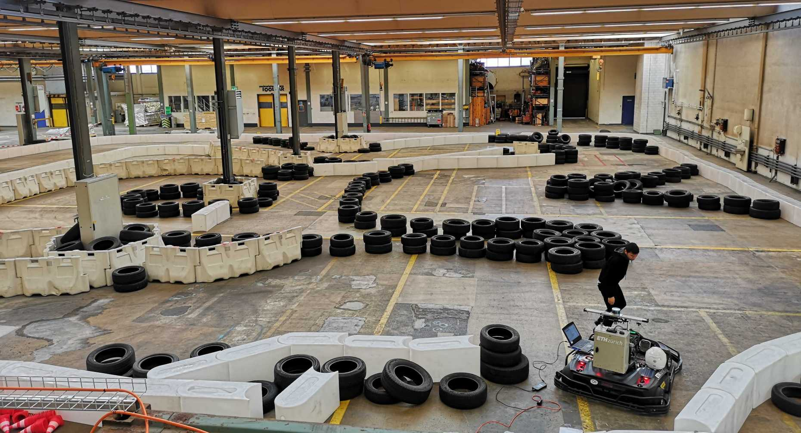
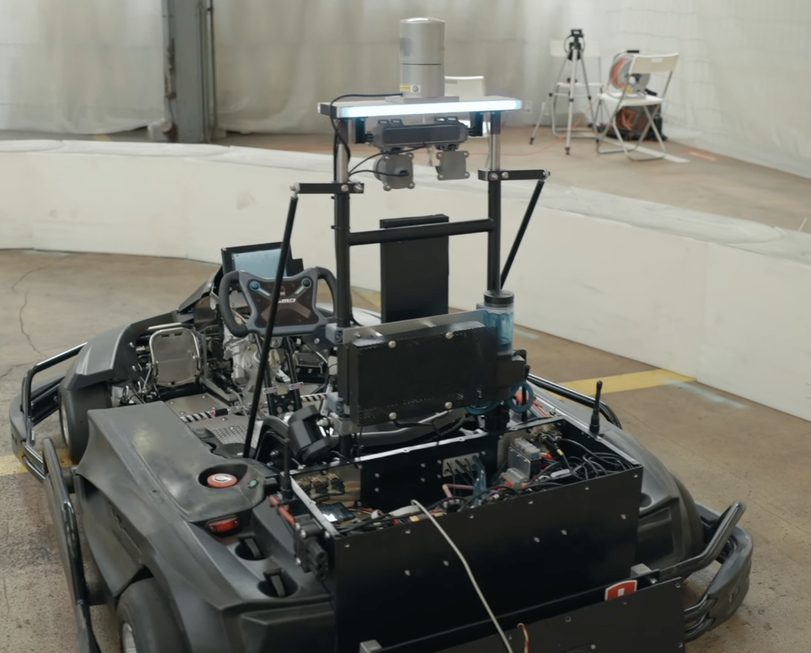
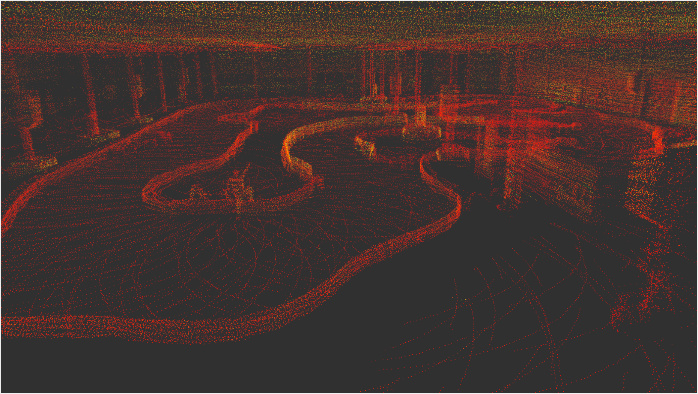
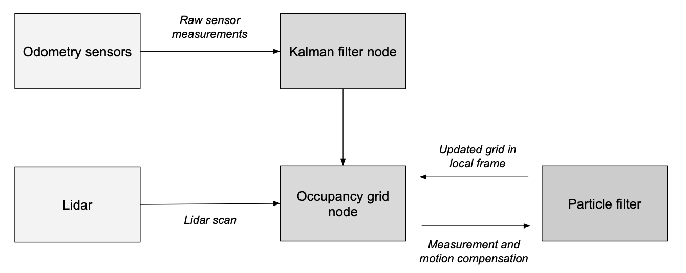
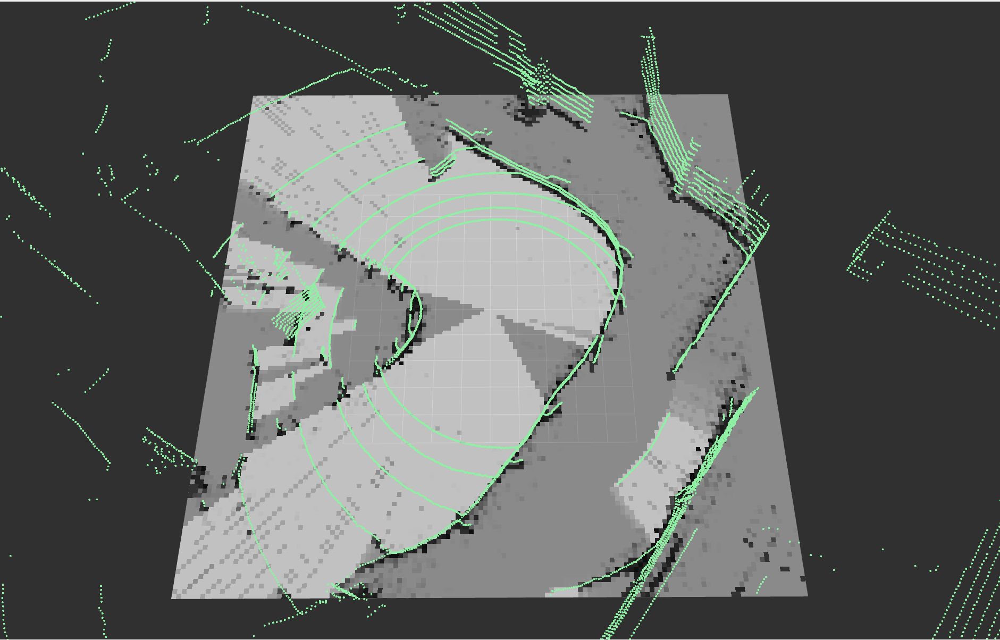
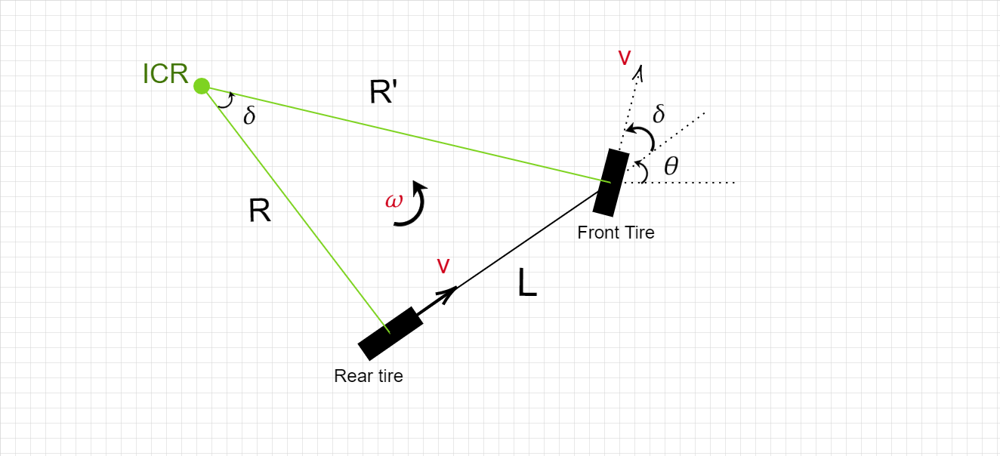
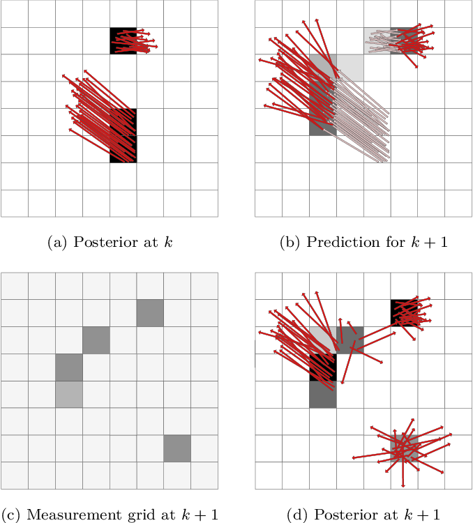
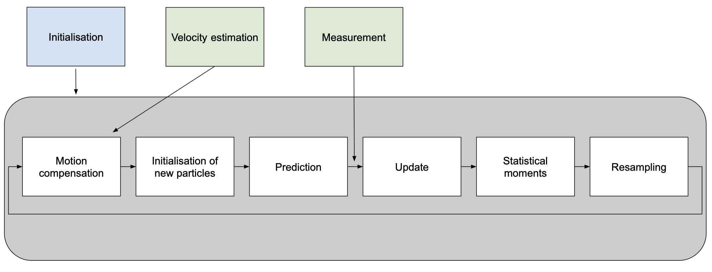
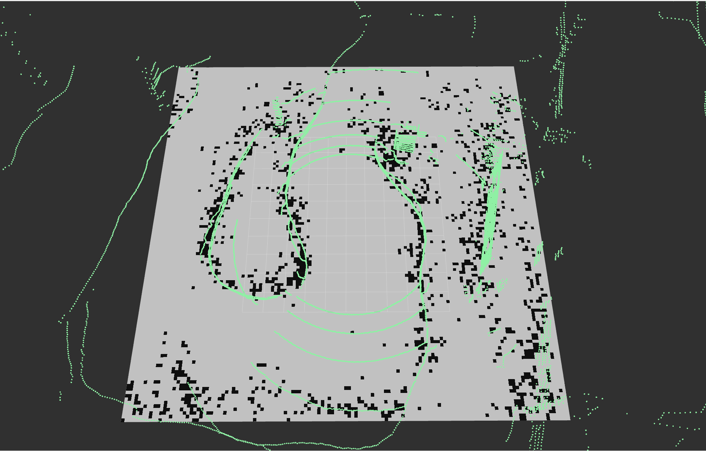

# SP-Dynamic-obstacle-detection-for-autonomous-gokarts🏎️

## Project Overview
This repository documents my semester project at ETH Zurich's Institute for Dynamic Systems and Control (IDSC), focused on developing a robust obstacle detection system for autonomous racing go-karts. The project introduces a novel approach using a dynamic occupancy grid in a local frame, enhancing reliability through localization independence.

*Note: The implementation code remains private within IDSC's repository.*

    
    
    

## Key Features
- **Localization-Independent Operation**: System operates in a local frame, reducing dependency on precise localization
- **Real-time Processing**: Achieves 20Hz update rate, matching LiDAR data acquisition frequency
- **Dynamic Obstacle Tracking**: Uses particle filter for tracking moving obstacles
- **Motion Compensation**: Implements Extended Kalman Filter for accurate state estimation
- **Free Space Interpolation**: Advanced algorithm for reducing grid sparsity while maintaining accuracy

## Technical Implementation

    

### 1. Dynamic Occupancy Grid
- Discretized 2D representation of the environment
- Probabilistic framework for distinguishing between occupied, free, and unknown spaces
- Integration of LiDAR measurements with interpolation for comprehensive spatial mapping

    

### 2. Motion Compensation
- Extended Kalman Filter (EKF) for state estimation
- Kinematic bicycle model for go-kart dynamics
- Integration of multiple sensor inputs:
  - Wheel encoders
  - Steering sensor
  - IMU
  - LiDAR with ICP

    

### 3. Particle Filter for Dynamic Obstacles
- State representation including position and velocity (x, y, vx, vy)
- Real-time tracking and prediction of obstacle movements
- Adaptive resampling for maintaining particle diversity

    

## Results and Performance

### Achievements
- Successfully implemented real-time processing at 20Hz
- Effective obstacle detection in static environments
- Reliable tracking of dynamic obstacles under moderate maneuvers
- Robust free space interpolation reducing grid sparsity

### Current Limitations
- Performance degradation during high-yaw maneuvers
- Computational constraints on CPU limiting particle count
- Assumptions about pitch and roll occasionally affecting accuracy
- Integration with planning systems pending

    
     
    Visualization showing the limitation of particle filter during high-yaw maneuvers

## Future Work

### Planned Improvements
1. **GPU Implementation**
   - Parallelization of particle filter computations
   - Support for increased particle count and grid resolution

2. **Motion Planning Integration**
   - Development of local frame planner
   - Interface with existing MPC trajectory planning

3. **System Enhancements**
   - Quantitative analysis and parameter optimization
   - Complex motion models for better obstacle prediction
   - Sensor fusion with camera data

## Academic Context
This project was conducted as a semester project at:
- **Institution**: ETH Zurich
- **Department**: Institute for Dynamic Systems and Control (IDSC)
- **Supervision**: Dr. Maurilio Di Cicco, Prof. Dr. Emilio Frazzoli
- **Date**: February 2024

## References
1. AMZ Driverless: The Full Autonomous Racing System
2. Random Finite Set Approach for Dynamic Occupancy Grid Maps with Real-time Application
3. Extended Kalman Filter Documentation

*Note: Implementation details and code are maintained privately within IDSC's repositories.*
